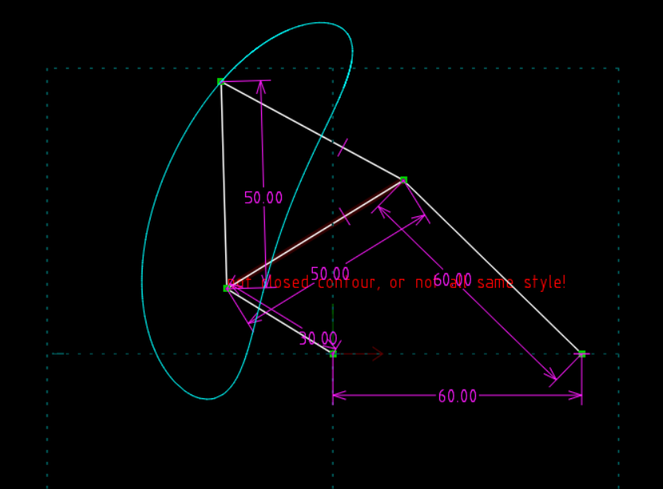
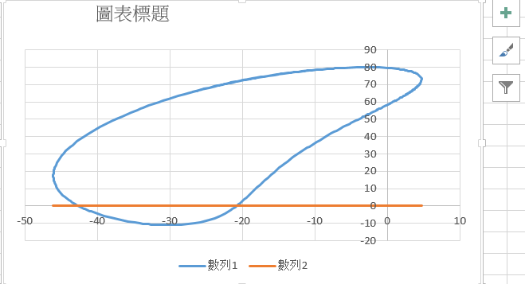

Title: 期中報告
Date: 2017-04-20 11:00
Category: homework
Tags: 期中報告
Slug: 期中報告
Author: 40423101

<!-- PELICAN_END_SUMMARY -->

(1)利用solvespace進行點路徑的分析

 

 

(2)用Excel進行點的分析

 

 

(3)利用程式繪製路徑
<!-- 導入 Brython 標準程式庫 -->
 

 
<!-- 啟動 Brython -->
 

 
<!-- 以下實際利用  Brython 畫四連桿 trace point 路徑-->
 
<canvas id="fourbar" width="600" height="400"></canvas>
 

 

 

##小組作業 40423101負責組合
<iframe src="https://player.vimeo.com/video/214393468" width="640" height="357" frameborder="0" webkitallowfullscreen mozallowfullscreen allowfullscreen></iframe>

<a href="https://vimeo.com/214393468">虎尾科技大學-機械設計系-40423101-ag2 組合</a> from <a href="https://vimeo.com/user44207266">曾宜萱</a> on <a href="https://vimeo.com">Vimeo</a>.

